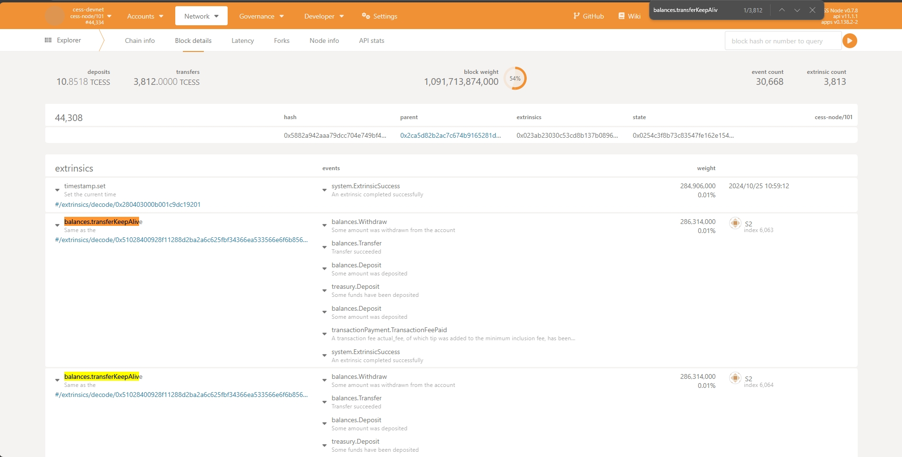

# cess-tps

CESS Chain TPS Testing: **The threshold of the number of transactions per second.**

# How to run the test

1: run cess chain with additional args `--rpc-max-subscriptions-per-connection 10000` with doc: https://doc.cess.network/cess-miners/consensus-miner/running

2: install `Node.js 18` and then execute command: `npm install`

3: set `SourceAccountMnemonic` and `RequestCount` in `config.js`

4: execute command to generate target accounts: `node init.js`

5: execute command to run testing: `node main.js`

**A block may be opened every 6 seconds on the Bitcoin blockchain, The current blockchain tps limit is about 500**

