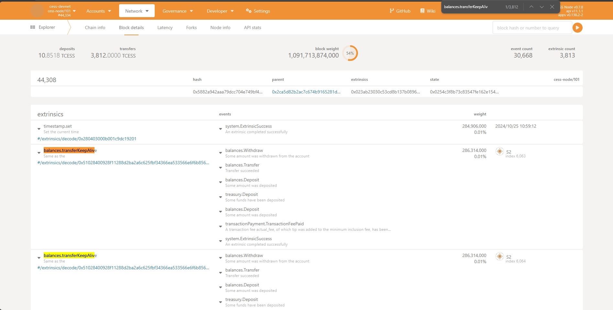

# CESS TPS Testing

CESS Chain TPS Testing: **The threshold of the number of transactions per second.**

# How to run the test

1: run cess chain with additional args `--rpc-max-subscriptions-per-connection 10000` with doc: https://doc.cess.network/cess-miners/consensus-miner/running

2: install `Node.js 18` and then execute command: `npm install`

3: set `ChainURL`, `SourceAccountMnemonic`, `GenerateAccountCount` and `RequestCount` in `config.js`

4: execute command to generate target accounts: `node init.js`

5: execute command to run testing: `node main.js`

# Conclusion
This general test shows that a single CESS blockchain can achieve over **635** TPS (3812 transactions, one block every 6 seconds) for balance transfer transactions. If the Performance benchmark is used, it will exceed **1000** TPS.
This is enough to meet the current needs of CESS's distributed storage. If demand surges in the future, CESS can run over 100 parachains; the projected TPS is well over **100,000**. 
